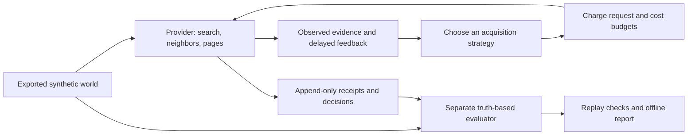

# Budgeted Discovery

**How should a data pipeline choose what to collect next when requests cost money and observations are incomplete?** Budgeted Discovery makes that tradeoff testable: compare acquisition strategies on the same synthetic world, charge every request, and replay each decision from an auditable event log.

The recorded main experiment contains **1,500 completed simulations across five strategies**. Observation limits changed the relative value of graph expansion and search; a fixed mixture did **not** consistently beat its better component. The public example runs five strategies locally and writes an offline HTML report, JSONL receipts, and Parquet evaluation curves.

**My contribution — Shawn Vazin:** designed and implemented the experiment platform, observation and budget contracts, acquisition policies, reproducible evaluation, and integrity checks. The project demonstrates experiment design, data engineering, and making a useful decision from a result that includes a failed hypothesis.

[Historical findings](docs/evaluation.md) · [Example output](reports/example.md) · [Data contract](docs/data-contract.md) · [Implementation](docs/architecture.md)

## Run the example

Use **Python 3.12**, a CPU, about 1 GiB of available memory, and 1 GiB of disk space for the environment. Package installation requires internet access; the experiment itself runs offline without credentials, paid services, a GPU, or Docker. Run from the repository root.

```bash
python -m venv .venv
```

Activate with `source .venv/bin/activate` on macOS/Linux or `.venv\Scripts\Activate.ps1` in PowerShell, then:

```bash
python -m pip install -r requirements.txt
python -m pip install --no-deps .
python scripts/demo.py --output runs/demo
python -m pytest -q
```

Expected headline: `Five strategies completed; five event-log replays verified.` A five-row result table follows. Open `runs/demo/report.html` in your browser. The bundled world has **120 synthetic accounts and eight time snapshots**; this example is **five newly executed runs on one world**, not a rerun of all 1,500 historical simulations. Choose a new output directory for each run. The example has a two-minute safeguard; typical execution is well below that limit.

## What is implemented



| Main-grid strategy | Decision rule |
|---|---|
| Random | Random valid acquisition action, providing a basic baseline |
| Graph | Expand observed neighborhoods, including pages and revisits |
| Query | Search and refine queries using observed text |
| Fixed mixture | Choose between graph and query experts; graph weight 0.75 selected on separate development seeds |
| Round robin | Alternate graph and query experts |

The implementation also contains a cost-aware heuristic and a **separate online River linear action-value policy**. Those two policies are **not part of the five-strategy main grid**. No claim of learned-policy superiority follows from the main-grid results.

## Evaluation and practical meaning

The historical experiment used 20 seeds × three target arrangements × five observation conditions × five strategies, with 24 requests and 32 cost units per run. Its outcome was newly reached, unique reference-relevant synthetic accounts, excluding common initial exposure.

| Registered question | Historical result |
|---|---|
| Does observation quality change graph-versus-query effectiveness? | Stress-minus-complete interaction **−2.73 accounts**, 95% seed-block bootstrap interval **[−4.35, −1.22]** |
| Does a mixture beat its better component in distributed-target worlds? | **+0.71 accounts**, interval **[−0.65, +2.02]**; pooled hypothesis **not supported** |

The useful lesson is conditional: pagination caps and missing information can change which acquisition choice works best. These findings are restricted to the declared simulator. Possible applications include prioritizing industrial data collection, analytics enrichment, or monitoring requests; those applications have **not been deployed or evaluated here**.

The actual experimental setting is a synthetic temporal account network generated with TADC-SBM and NDlib, with generated profiles, posts, relevance labels, and noisy delayed feedback. It has no live social-network API, external customer data, or industrial deployment. The small vocabulary, target construction, and 120-account world size limit generalization. [Read the evaluation and limitations](docs/evaluation.md).

Recheck the released historical rows and reproduce the statistical analysis:

```bash
python scripts/verify_historical.py
python scripts/analyze_main_grid.py --aggregate data/historical --output runs/historical-analysis
```

This recalculates statistics from recorded summaries. It does not regenerate historical worlds or replay the entire historical event archive. The released example supports full decision replay on its new runs.

## Project history, data, and license

Relevant implementation commits from September 17, 2026 are preserved with their original authors and dates through a path-scoped history extraction. Their hashes changed with the reduced trees; commit messages omit session metadata. Original commit descriptions can refer to broader experiment work; only the released files are present here. The public demonstration, data extract, documentation, and CI were prepared on September 20, 2026. No contribution dates were manufactured.

All included world data and historical outcomes are synthetic artifacts created for this project. [Data provenance and schemas](docs/data-contract.md) describe the exact included scope. [Third-party notices](THIRD_PARTY_NOTICES.md) preserve dependency and algorithm attribution. No open-source license is currently granted for the original code or original example assets; see [license status](LICENSE_STATUS.md).
